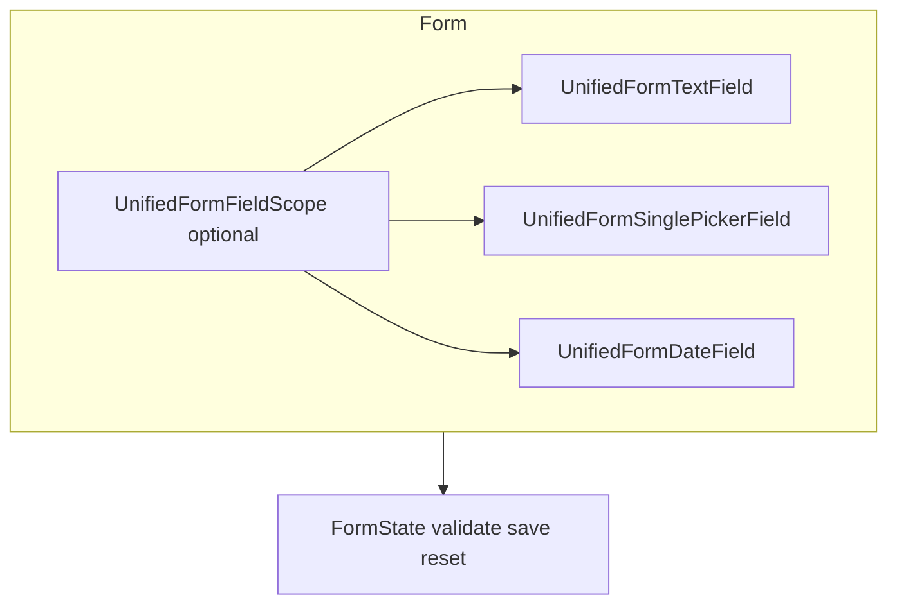

# unified_fields

**Unified Flutter input widgets**—text, numbers, pickers, duration, date & time—and **form-aware** wrappers that plug into [`Form`](https://api.flutter.dev/flutter/widgets/Form-class.html) with validation, save, reset, and optional **shake-on-error** feedback. Includes a **Gregorian / Jalali (Shamsi)** calendar sheet and a **vendored scrollable positioned list** for large picker lists (no `scrollable_positioned_list` pub dependency).

---

## Table of contents

1. [Add to your app](#add-to-your-app)  
2. [What you get (feature map)](#what-you-get-feature-map)  
3. [Core concepts](#core-concepts)  
4. [Form integration (validate · save · reset)](#form-integration-validate--save--reset)  
5. [Shake on validation error](#shake-on-validation-error)  
6. [Date & calendar](#date--calendar)  
7. [Time](#time)  
8. [Pickers](#pickers)  
9. [Bindings with `AppInputController`](#bindings-with-appinputcontroller)  
10. [Field controllers](#field-controllers)  
11. [Field states (`isDisabled`, `loading`, …)](#field-states-isdisabled-loading-)  
12. [Theming & layout](#theming--layout)  
13. [Localization](#localization)  
14. [Try the built-in demo](#try-the-built-in-demo)  
15. [Dependencies](#dependencies)  

---

## Add to your app

Published on **[pub.dev/packages/unified_fields](https://pub.dev/packages/unified_fields)**. In **`pubspec.yaml`**:

```yaml
dependencies:
  unified_fields: ^0.1.3
```

Run **`dart pub get`** (or **`flutter pub get`**).

**Import**

```dart
import 'package:unified_fields/unified_fields.dart';
```

**SDK:** Dart `^3.10`, Flutter `>=3.22` (see `pubspec.yaml`).

### Git or local path (contributors / forks)

If you need a specific commit or a local checkout instead of pub.dev:

```yaml
dependencies:
  unified_fields:
    git:
      url: https://github.com/MahmoodBakhshayesh/unified_fields.git
      ref: main # or a tag / commit SHA
```

```yaml
dependencies:
  unified_fields:
    path: ../unified_fields # relative path to your clone
```

---

## What you get (feature map)

| Area | Widgets / APIs | Purpose |
|------|------------------|---------|
| **Plain fields** | `UnifiedTextField`, `UnifiedNumberField`, `UnifiedNumericStepField`, `UnifiedDurationField`, `UnifiedDateField`, `UnifiedDateRangeField`, `UnifiedTimeOfDayField` | Same visual system as form fields, without `FormField` |
| **Pickers** | `UnifiedSinglePickerField`, `UnifiedMultiPickerField`, `UnifiedAsyncPickerField`, `UnifiedAsyncMultiPickerField` | Bottom-sheet selection; async variants load items on demand |
| **Customizable pickers** | `UnifiedCustomizablePickerField`, `UnifiedCustomizableMultiPickerField`, `UnifiedCustomizableAsyncPickerField`, `UnifiedCustomizableAsyncMultiPickerField`, `CustomizableSinglePickerController`, `CustomizableMultiPickerController` | Controller-driven single or multi selection that also accepts free typed text |
| **Form wrappers** | `UnifiedFormField`, `UnifiedFormTextField`, `UnifiedFormSinglePickerField`, `UnifiedFormMultiPickerField`, `UnifiedFormAsyncPickerField`, `UnifiedFormAsyncMultiPickerField`, `UnifiedFormDateField`, `UnifiedFormDateRangeField`, `UnifiedFormTimeOfDayField`, `UnifiedFormDurationField`, `UnifiedFormNumberField`, `UnifiedFormCustomizablePickerField`, `UnifiedFormCustomizableMultiPickerField`, `UnifiedFormCustomizableAsyncPickerField`, `UnifiedFormCustomizableAsyncMultiPickerField` | `Form` integration: `validate`, `save`, `reset`, validators |
| **Form scope** | `UnifiedFormFieldScope` | Shared `AutovalidateMode` for all unified form descendants |
| **Calendar** | `showUnifiedFieldsDatePicker`, `showUnifiedFieldsDatePickerRange`, `UnifiedFieldsDatePickerSheet`, `UnifiedFieldsDatePickerGranularity`, `UnifiedFieldsCalendarKind` | Single date or range; day / month / year granularity; Gregorian vs Jalali toggle |
| **Time** | `TimePickerUtils.show` | Wraps `showTimePicker` with sensible defaults |
| **Chrome helpers** | `UnifiedBaseTextField`, `AppUnifiedFieldShell`, `UnifiedInputDecoration`, `UnifiedInputBrightness`, `UnifiedInputPalette`, `UnifiedInputTheme`, `UnifiedInputThemeScope` | Labels, errors, light/dark palettes, optional global theme scope |
| **Controllers** | `UnifiedPickerFieldController`, `UnifiedMultiPickerFieldController`, `UnifiedAsyncPickerFieldController`, `UnifiedDateFieldController`, `UnifiedTimeOfDayFieldController`, `UnifiedDurationFieldController`, `UnifiedNumberFieldController`, `UnifiedFormController` | Listenable value + validation + imperative `openPicker` / `requestFocus` |
| **Utilities** | `AppInputController`, `UnifiedFieldsContextX`, `UnifiedColors`, `UnifiedSheetButton`, `unifiedFormErrorText`, `unifiedFormPickerOverride`, `attachUnifiedFieldHandles` | State binding, layout helpers, default colors, sheet actions, field ↔ controller wiring |
| **Demo** | `UnifiedInputsShowcasePage` | Scrollable gallery of widgets + palette toggle |

---

## Core concepts

### One visual language

Fields share **`UnifiedInputDecoration`** (label, placeholder, radii, validation colors, prefix/suffix) and **`UnifiedInputBrightness`** (light / dark palette). Use **`UnifiedInputThemeScope`** to push a palette or brightness subtree without threading parameters everywhere.

### Two usage modes

1. **Standalone** — e.g. `UnifiedTextField`, `UnifiedSinglePickerField`: drop into any screen; you own validation if needed.  
2. **Under a `Form`** — use `UnifiedForm…` variants so **`GlobalKey<FormState>`** can call **`validate()`**, **`save()`**, and **`reset()`** on the whole form.

### `label`, `placeholder`, `isRequired`

Every field exposes **`label`**, **`placeholder`**, and **`isRequired`** as root-level constructor parameters. They always win over the equivalent values inside **`UnifiedInputDecoration`** (which still work as the form-wide default):

```dart
UnifiedTextField(
  label: 'Email',
  placeholder: 'name@example.com',
  isRequired: true,
)
```

### `UnifiedFormField<T>`

Low-level shell: one **`FormField<T>`** + your **`builder`**. Prefer the prebuilt `UnifiedForm…` widgets; use **`UnifiedFormField`** when you need a custom control but the same autovalidate, reset sync, and optional **`shakeOnError`**.

---

## Form integration (validate · save · reset)

Wrap inputs in a **`Form`** and keep a key:

```dart
final _formKey = GlobalKey<FormState>();

@override
Widget build(BuildContext context) {
  return Form(
    key: _formKey,
    child: Column(
      children: [
        UnifiedFormTextField(
          label: 'Name',
          validator: (v) => (v == null || v.isEmpty) ? 'Required' : null,
        ),
        UnifiedFormSinglePickerField<String?>(
          label: 'Country',
          items: countries,
          resetValue: () => null, // on Form reset, clear selection
          validator: (v) => v == null ? 'Pick one' : null,
        ),
        FilledButton(
          onPressed: () {
            if (_formKey.currentState!.validate()) {
              _formKey.currentState!.save();
            }
          },
          child: const Text('Submit'),
        ),
      ],
    ),
  );
}
```

### Reset behavior — `UnifiedFormResetValue<T>`

```dart
typedef UnifiedFormResetValue<T> = T Function();
```

| You pass | On `FormState.reset` |
|----------|----------------------|
| `resetValue: null` (default) | Field value is **not** forced by reset (baseline tracks live value / controller). |
| `resetValue: () => ''` | Text / number string resets to empty. |
| `resetValue: () => null` | Nullable picker / date clears to **null** (use nullable generic, e.g. `UnifiedFormSinglePickerField<MyEnum?>`). |
| `resetValue: () => model.defaultX` | Restores that snapshot (pass a **new** closure if the snapshot should change). |
| Lists | `UnifiedFormMultiPickerField`: `resetValue: () => const <T>[]` or `() => myList` |

Nullable **return type** is carried by **`T`** on the picker (e.g. `RoastLevel?`), not by `T?` on the typedef.

---

## Shake on validation error

Any `UnifiedForm…` widget and **`UnifiedFormField`** accept **`shakeOnError`** (default **`false`**). When **`true`**, the field runs a short horizontal shake the first time **`hasError`** goes from false to true (typical failed **`validate()`**).

```dart
UnifiedFormTextField(
  label: 'Email',
  shakeOnError: true,
  validator: (v) => v!.contains('@') ? null : 'Invalid',
)
```

---

## Date & calendar

### Sheet API

- **`showUnifiedFieldsDatePicker`** — returns **`DateTime?`**.  
- **`showUnifiedFieldsDatePickerRange`** — returns **`DateTimeRange?`**.  

Presentation: **bottom sheet** on smaller widths; **centered dialog** when **`context.isDesktop`** is true (see **`UnifiedFieldsContextX`** — width ≥ 900).

### Granularity (`UnifiedFieldsDatePickerGranularity`)

- **`day`** — full month grid (default).  
- **`month`** — pick first day of month in range.  
- **`year`** — pick first day of year in range.  

### Calendars (`UnifiedFieldsCalendarKind`)

Users can switch **Gregorian** vs **Jalali (Shamsi)** when **`showCalendarKindToggle`** is true. Jalali math uses the **`shamsi_date`** package.

### Widgets

- **`UnifiedDateField`** / **`UnifiedFormDateField`** — text field + tap to open picker.  
- **`UnifiedDateRangeField`** / **`UnifiedFormDateRangeField`** — range in one field.

---

## Time

- **`UnifiedTimeOfDayField`** / **`UnifiedFormTimeOfDayField`** — display + edit time with your chrome.  
- **`TimePickerUtils.show(context, …)`** — thin wrapper around **`showTimePicker`** using **`MaterialLocalizations`** for OK/cancel and English **Hour** / **Minute** labels (override in your fork if needed).

---

## Pickers

| Widget | Data |
|--------|------|
| **`UnifiedSinglePickerField<T>`** | `T?` selection, searchable list, suggestions |
| **`UnifiedMultiPickerField<T>`** | `List<T>`, checkboxes in sheet |
| **`UnifiedAsyncPickerField<T>`** | Items from `Future<List<T>> Function()` |
| **`UnifiedAsyncMultiPickerField<T>`** | Same, multi-select |

**`PickerSheetWidget`** / **`MultiPickerSheetWidget`** are the sheet implementations (scrollable list + search). Form variants mirror the same behavior with **`FormField`**.

**Customizable** APIs (`unified_cutomizable_picker_fields.dart` — filename keeps the historical typo **cutomizable**): single or multi selection with **`CustomizableSinglePickerController`** / **`CustomizableMultiPickerController`** plus async siblings for remote data. Each controller carries either typed text **or** the selected value(s); the matching **`UnifiedFormCustomizable…`** wrappers expose `resetValue` snapshots so `FormState.reset` restores both the mode and the payload in one step.

---

## Bindings with `AppInputController`

**`AppInputController<T>`** is a **`ChangeNotifier`** holding **`value`**, optional **`errorText`**, and helpers **`clear`**, **`setError`**, **`silentSetValue`**. Pass it as **`binding:`** on fields so UI and domain state stay in sync; form wrappers also write back on save/reset when configured.

Form-aware pickers and date/time fields **listen to the binding**, so clearing from code updates the visible field:

```dart
final country = AppInputController<String?>();

UnifiedFormSinglePickerField<String?>(
  label: 'Country',
  binding: country,
  items: countries,
);

// Later — UI and FormField both clear:
country.clear();
```

You can use **`binding`** and **`fieldController`** together: the binding holds app state; the typed controller adds picker-specific APIs (`openPicker`, `displayText`, sheet options).

---

## Field controllers

**`BaseUnifiedFieldController<T>`** (and typed subclasses) mirror **`TextEditingController`** for pickers, dates, numbers, and duration. Pass **`fieldController:`** on the matching **`Unified…`** widget.

| Controller | Field(s) |
|------------|----------|
| **`UnifiedPickerFieldController<T>`** | `UnifiedSinglePickerField`, `UnifiedAsyncPickerField` |
| **`UnifiedMultiPickerFieldController<T>`** | `UnifiedMultiPickerField`, `UnifiedAsyncMultiPickerField` |
| **`UnifiedDateFieldController`** | `UnifiedDateField` |
| **`UnifiedDateRangeFieldController`** | `UnifiedDateRangeField` |
| **`UnifiedTimeOfDayFieldController`** | `UnifiedTimeOfDayField` |
| **`UnifiedDurationFieldController`** | `UnifiedDurationField` |
| **`UnifiedNumberFieldController`** | `UnifiedNumberField`, `UnifiedNumericStepField` |

When the field is **mounted**, **`openPicker(context)`** (and async **`openPickerAsync`**) use the same code path as a tap—no need to pass **`items`** / **`label`** again. Off-tree or tests: call **`bindPicker`** / **`bindPickerLabel`** first, or pass **`items`** and **`label`** explicitly.

**`requestFocus()`** on the controller (or on a **`binding`** that shares the attached focus node) focuses the wired field.

**`UnifiedFormController`** coordinates multiple controllers for validate/save/reset on a custom form layout.

---

## Field states (`isDisabled`, `loading`, …)

Shared by **`UnifiedBaseTextField`** and every field built on it:

| Parameter | Effect |
|-----------|--------|
| **`isDisabled` / `disabled`** | Read-only look; when both placeholder and value exist, **both** are shown (not hidden like a greyed empty field). |
| **`locked`** | Blocks interaction; distinct from disabled styling. |
| **`loading`** | Small **suffix spinner** (replaces dropdown/chevron); field does **not** use full-field overlay or muted disabled colors. |
| **`interactionBlocked`** | Absorbs pointer events without disabled chrome—used for pick-only surfaces (date, async picker while idle). |
| **`labelInRow`** | Label and body share **one** rounded border; a straight vertical divider separates them (no inner radius on the body edge). |

Async pickers set **`loading: true`** while **`itemProvider`** runs; date fields use **`interactionBlocked: true`** so the platform picker still opens without **`disabled: true`**.

---

## Theming & layout

- **`UnifiedColors`** — default static palette used by built-in styles (replace over time with your design tokens or override via **`UnifiedInputDecoration`** / **`Theme`**).  
- **`resolveUnifiedDecoration(context, overrides: …, brightness: …)`** — merges theme + field overrides (used internally by several fields).  
- **`UnifiedFieldsContextX`** on **`BuildContext`**: **`width`**, **`height`**, **`isDesktop`**, **`mainColor`** — no dependency on routing or app-specific l10n.  
- **`UnifiedSheetButton`** — compact primary / outlined actions used inside picker sheets.

---

## Localization

- **Date picker UI strings** live in **`UnifiedDatePickerStrings`** (`unified_date_picker_sheet.dart`). Defaults are **English**; copy or subclass and wire your own strings for production i18n.  
- **Time picker** uses **`MaterialLocalizations`** where possible; hour/minute labels are English literals in **`TimePickerUtils`**.  
- **Clear** tooltip on the base text field uses **`MaterialLocalizations.deleteButtonTooltip`**.

---

## Try the built-in demo

**`UnifiedInputsShowcasePage`** is a long-form scroll demo with a brightness / palette toggle. Push it from debug menus or a settings screen:

```dart
Navigator.of(context).push(
  MaterialPageRoute<void>(
    builder: (_) => const UnifiedInputsShowcasePage(),
  ),
);
```

A runnable example app lives in **`example/`** — open it with `flutter run` from that folder to interact with every field in isolation.

---

## Dependencies

| Package | Role |
|---------|------|
| **`intl`** | Date/number formatting in date fields and picker |
| **`shamsi_date`** | Jalali calendar conversion |
| **`collection`** | Used by the **vendored** scrollable list implementation |

Async pickers show loading via the field **suffix spinner** (`loading` on **`UnifiedBaseTextField`**), not a full-field overlay.

### Vendored code

Under **`lib/src/scrollable_list/`** you’ll find a local copy of a **scrollable positioned list** implementation (same family as the popular package, kept in-tree so this package stays self-contained).

---

## Architecture sketch



---

## Version

Current release: **`0.1.3`** (see **`pubspec.yaml`** and [pub.dev](https://pub.dev/packages/unified_fields/versions) for the latest). Follow semver when upgrading.

---

## License

See the **`LICENSE`** file in this repository.
